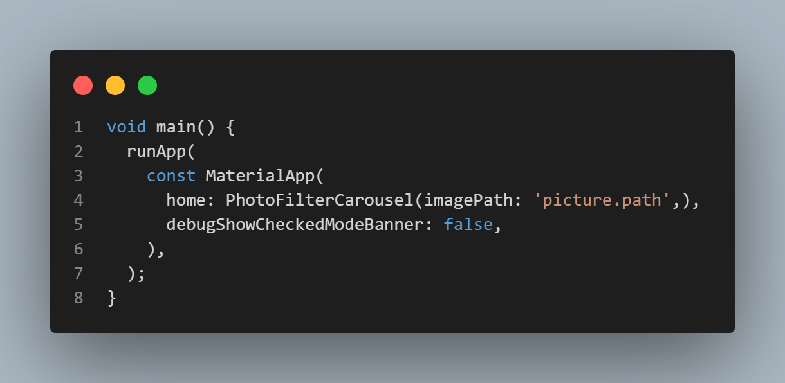

# tugaskamera

A new Flutter project.

# Nama    : jejen jaenudin
# NIM     : 1125170031

## Getting Started

## A. code main.dart serta penjelasan
**Berikut code lengkap main.dart**

Berikut adalah penjelasan rinci tentang fungsi setiap bagian kode:

**1. main() function:**

    - WidgetsFlutterBinding.ensureInitialized(): Fungsi ini memastikan bahwa binding untuk widget Flutter sudah 
      diinisialisasi sebelum menjalankan kode lain. Ini sangat penting saat aplikasi menggunakan asinkronitas atau ketika berinteraksi dengan perangkat keras (seperti kamera) sebelum tampilan pertama ditampilkan.

    - final cameras = await availableCameras();: Fungsi ini menggunakan package camera untuk mendapatkan daftar 
      kamera yang tersedia di perangkat (misalnya kamera depan dan belakang). Hasilnya adalah daftar objek CameraDescription yang berisi informasi tentang setiap kamera yang tersedia.

    - final firstCamera = cameras.first;: Setelah mendapatkan daftar kamera, kode ini memilih kamera pertama 
      (biasanya kamera belakang perangkat).

    - runApp(MyApp(camera: firstCamera)): Fungsi ini menjalankan aplikasi Flutter dengan widget MyApp dan 
      melewatkan firstCamera ke widget tersebut. Ini adalah langkah penting untuk memberikan akses kamera ke bagian lain dari aplikasi.

**2. MyApp class:**

    - final CameraDescription camera;: Di dalam MyApp, ada sebuah variabel camera yang digunakan untuk 
      menyimpan objek CameraDescription, yang telah diteruskan dari main().
    - const MyApp({super.key, required this.camera});: Konstruktor ini menerima camera yang dibutuhkan sebagai 
      parameter yang diteruskan saat memanggil MyApp dari main().

    - @override Widget build(BuildContext context): Ini adalah metode yang dipanggil untuk membangun UI  
      aplikasi. Metode ini mengembalikan widget yang menjadi dasar dari aplikasi, dalam hal ini MaterialApp.

    - MaterialApp: Ini adalah widget utama untuk aplikasi berbasis material design. Dalam hal ini, tema yang  
      digunakan adalah tema gelap (ThemeData.dark()), dan home merujuk ke halaman pertama yang akan ditampilkan, yaitu TakePictureScreen (menggunakan kamera yang diteruskan).

    - debugShowCheckedModeBanner: false: Baris ini mematikan tampilan banner debug yang biasanya muncul di 
      sudut kanan atas aplikasi ketika aplikasi dijalankan di mode debug.

# **B. code takepicture_screen.dart serta penjelasan**
--Berikut kode lengkap dan penjelasannya untuk takepicture_screen.dart--

**1. TakePictureScreen Widget (StatefulWidget):**
    

    - TakePictureScreen adalah sebuah StatefulWidget, yang berarti widget ini memiliki status yang dapat 
      berubah (seperti kontrol kamera atau status pemrosesan gambar).
    - camera adalah parameter yang diteruskan ke widget ini, yang merupakan objek CameraDescription yang 
      mengandung informasi tentang kamera yang digunakan (kamera depan atau belakang).

**2. TakePictureScreenState (State dari TakePictureScreen):**

    - _controller adalah objek CameraController, yang digunakan untuk mengontrol kamera dan menangani 
      pengambilan gambar.

    - _initializeControllerFuture adalah Future yang digunakan untuk menunggu inisialisasi kamera.

**3. initState() (Inisialisasi Kamera):**

    - Pada initState(), kita menginisialisasi kamera menggunakan CameraController.
    - Kita menentukan ResolutionPreset.medium untuk mengatur kualitas gambar (resolusi).
    - Setelah itu, kamera diinisialisasi dengan _controller.initialize() yang mengembalikan Future.     
      Inisialisasi ini akan membutuhkan waktu, jadi kita perlu menunggu penyelesaian sebelum menampilkan tampilan kamera.

**4. dispose() (Membuang Kamera saat Widget Dihancurkan):**

    - dispose() dipanggil ketika widget ini dihancurkan untuk membersihkan sumber daya (dalam hal ini, kita 
       membuang _controller untuk menghindari kebocoran memori).

**5. build() (Membangun UI):**

    - FutureBuilder<void> digunakan untuk menunggu inisialisasi kamera. Saat _initializeControllerFuture belum 
      selesai, kita menampilkan CircularProgressIndicator sebagai indikator pemuatan.
    - Setelah kamera berhasil diinisialisasi, CameraPreview(_controller) menampilkan pratinjau kamera.
    - Terdapat tombol "Take Picture" di bawah pratinjau kamera. Ketika tombol ini ditekan:
    - _controller.takePicture() digunakan untuk mengambil gambar.
    - Setelah gambar berhasil diambil, gambar disimpan dalam XFile yang mengandung path gambar.
    - Gambar yang diambil kemudian diteruskan ke halaman PhotoFilterCarousel untuk memungkinkan pengguna 
      menambahkan filter foto. Gambar diteruskan melalui imagePath sebagai parameter.

# **C. code displaypicture_screen.dart serta penjelasan**

**Berikut kode lengkap untuk displaypicture_screen.dart**

**1. DisplayPictureScreen Widget (StatelessWidget):**

    - DisplayPictureScreen adalah sebuah StatelessWidget, yang berarti widget ini tidak memiliki status 
      internal yang dapat berubah (widget ini hanya akan menampilkan gambar berdasarkan data yang diterimanya).

    - imagePath adalah parameter yang diterima oleh widget ini, yang menyimpan path (lokasi file) gambar yang 
      akan ditampilkan. Gambar ini biasanya diambil dari kamera, dan path-nya diteruskan ke widget ini.

**2. build() Method:**

    - Scaffold adalah struktur dasar untuk sebuah halaman (screen) di Flutter, yang menyediakan AppBar, area 
      tubuh halaman (body), dan elemen lainnya.

    - AppBar: Bagian atas layar yang biasanya menampilkan judul aplikasi. Di sini, judulnya adalah 'Foto Jejen'.

    - body: Bagian utama dari tampilan layar, di mana gambar akan ditampilkan.

## **PRAKTEKUM 2 Photo_Filter_Carousel**

**Berikut kode dan penjelasan selengkapnya**

Untuk pembuatan project yang ke 2 ini ialah membuat bagai mana hasil dari tangkap layar atau foto bisa menggunakan filter

berikut code dan penjelasan yang saya buat
# **A. main.dart**

**1. library photo_filter_carousel;**
    Library photo_filter_carousel; adalah kode pembuatan filterItem, dimna setiap item di carousel bisa memiliki efek filter berwarna

    - Fungsi: library digunakan untuk memberi nama pada library (pustaka) di Dart. Meskipun dalam pengembangan 
      Flutter aplikasi biasa, biasanya kita tidak perlu mendeklarasikan library secara eksplisit, ini bisa digunakan jika Anda bekerja dengan paket Dart tertentu.
    - Penggunaan: Dalam kode ini, photo_filter_carousel adalah nama library yang dideklarasikan, tetapi 
      penggunaan library ini tidak wajib jika Anda membuat aplikasi Flutter biasa.
    
**2. import 'package:flutter/material.dart';**

    - Fungsi: Mengimpor paket material.dart yang menyediakan berbagai widget dan elemen desain berbasis 
      Material Design yang digunakan dalam pengembangan aplikasi Flutter.
    - Penggunaan: Dengan mengimpor paket ini, Anda bisa menggunakan widget dan fungsi seperti Scaffold, Text, 
      Container, Column, dll., yang digunakan dalam aplikasi berbasis Flutter.

**3. import 'filter_carousel.dart';**

    - Fungsi: Mengimpor file Dart lain yang berada di dalam proyek, yakni filter_carousel.dart.
    - Penggunaan: File ini mungkin berisi widget lain atau fungsi terkait dengan carousel foto, yang digunakan 
      dalam aplikasi ini. Sayangnya, isi file tersebut tidak ditunjukkan dalam kode yang ada.

**4. void main() {...}**

    - Fungsi: Ini adalah titik masuk utama aplikasi Flutter. Fungsi main() akan dijalankan pertama kali saat 
      aplikasi dimulai.
    - runApp: Fungsi ini digunakan untuk meluncurkan aplikasi Flutter dengan widget utama (MaterialApp).
    - MaterialApp: Ini adalah widget aplikasi dasar yang menyediakan berbagai fitur Material Design seperti 
      navigasi, tema, dan scaffold.
    - home: PhotoFilterCarousel(imagePath: 'picture.path',): Menentukan widget PhotoFilterCarousel sebagai 
      halaman utama aplikasi dengan properti imagePath yang berisi string 'picture.path' (ini hanya contoh, biasanya diganti dengan URL atau path gambar yang valid).
    - debugShowCheckedModeBanner: false: Menonaktifkan banner debug yang muncul di aplikasi saat dijalankan 
      dalam mode debug.

**5. @immutable**
    - Fungsi: Anotasi ini digunakan untuk menunjukkan bahwa kelas yang mengikutinya adalah immutable (tidak 
      dapat diubah). Kelas ini tidak akan mengubah keadaan (state) setelah konstruksi objek dilakukan, yang membuatnya lebih efisien dan aman dalam penggunaan.
    - Penggunaan: Dalam Flutter, widget yang menggunakan anotasi @immutable biasanya digunakan untuk widget   
      stateless yang tidak memerlukan perubahan setelah mereka dibangun.

**6. FilterItem Widget**

    - Fungsi: Kelas FilterItem adalah widget stateless yang menerima dua parameter:
        -color: Warna yang digunakan sebagai filter pada gambar.
        -onFilterSelected: Sebuah callback opsional yang akan dipanggil ketika pengguna mengetuk item filter.
    - StatelessWidget: Ini berarti widget tidak memiliki status yang berubah-ubah dan hanya bergantung pada 
      data yang diterima melalui konstruktor.

**7. Properti color dan onFilterSelected**

    - color adalah parameter bertipe Color yang akan digunakan untuk memberi warna filter pada gambar.
    - onFilterSelected adalah callback opsional yang akan dipanggil ketika pengguna memilih filter ini 
      (misalnya saat mengetuk gambar).

**8. Widget build(BuildContext context)**

    - GestureDetector: Digunakan untuk mendeteksi gerakan pengguna, seperti ketukan. Dalam hal ini, ketika 
      pengguna mengetuk filter item, fungsi onFilterSelected akan dipanggil jika diberikan.
    - AspectRatio: Widget ini memastikan bahwa anak widgetnya memiliki rasio aspek 1:1 (persegi), sehingga  
      widget ini akan berbentuk persegi.
    - Padding: Memberikan padding sekitar widget ClipOval sebesar 8 piksel.
    - ClipOval: Mengklip gambar menjadi bentuk oval (dalam hal ini menjadi lingkaran).
    - Image.network: Widget ini digunakan untuk memuat gambar dari URL yang diberikan ('imagePath'). Namun, ini 
      adalah string statis, yang harus diganti dengan variabel dinamis atau nilai gambar yang benar.
       - color: color.withValues(alpha: 0.5): Sepertinya ada kesalahan di sini, karena color.withValues 
         bukanlah metode yang valid pada objek Color. Anda mungkin ingin menggunakan color.withOpacity(0.5) untuk memberikan efek transparansi pada warna filter.
        - colorBlendMode: BlendMode.hardLight: Ini adalah mode blending yang mengubah bagaimana warna filter 
          diterapkan ke gambar. BlendMode.hardLight memberikan efek blending yang lebih kuat dan terang.

# **B. photo_filter_carousel.dart**

photo_filter_coursel.dart ini bertujuan untuk membuat sebuah aplikasi yang menampilkan gambar dengan filter yang dbisa diubah oleh pengguna melalui widget carousel.
berikut code serta penjelasannya

**1. Import Statements**

    - dart:io: Ini digunakan untuk bekerja dengan file, dalam hal ini untuk membuka gambar dari sistem file 
      menggunakan File(widget.imagePath).
    - flutter/material.dart: Paket ini mengimpor widget dan elemen desain Material yang digunakan untuk  
      membangun antarmuka pengguna di Flutter.
    - filter_selector.dart: Ini mengimpor widget FilterSelector, yang tampaknya adalah widget kustom untuk 
      memilih filter gambar. Anda perlu memeriksa file ini untuk mengetahui lebih lanjut, tetapi yang jelas widget ini mengelola pemilihan filter oleh pengguna.

**2. PhotoFilterCarousel Widget**

    - PhotoFilterCarousel adalah widget stateful yang menerima imagePath (jalur gambar) sebagai parameter.
    - @immutable: Mengindikasikan bahwa widget ini bersifat immutable. Artinya, setelah objek widget dibuat, 
      nilai-nilai propertinya tidak dapat diubah.
    - imagePath: Ini adalah path atau URL gambar yang diterima dari kamera atau sumber lain untuk ditampilkan.
    - createState(): Mengembalikan objek state _PhotoFilterCarouselState yang mengelola status dari widget ini 
      (seperti filter yang diterapkan).

 **3. _PhotoFilterCarouselState**

    _filters adalah daftar warna yang akan digunakan sebagai filter untuk gambar. Dimulai dengan warna putih, kemudian diikuti oleh warna-warna dari Colors.primaries yang diambil dengan pola tertentu (dengan perhitungan index - 4 untuk menghasilkan warna-warna tertentu dalam daftar primer).

  final _filterColor = ValueNotifier<Color>(Colors.white);

    _filterColor adalah ValueNotifier yang digunakan untuk mengelola status filter warna yang diterapkan pada gambar. ValueNotifier memungkinkan pembaruan nilai yang dapat didengar oleh widget lain untuk membangun ulang UI jika nilainya berubah. Nilai awalnya adalah Colors.white.

**4. _onFilterChanged Function**

  void _onFilterChanged(Color value) {
    _filterColor.value = value;
  }

_onFilterChanged adalah metode yang akan dipanggil saat pengguna memilih filter warna baru. Fungsi ini akan mengubah nilai dari _filterColor menjadi warna yang dipilih oleh pengguna.

**5. Widget build**

- build adalah metode yang mengembalikan tampilan dari widget. Dalam hal ini, Material digunakan sebagai widget 
  pembungkus utama untuk memberi latar belakang warna hitam.
- Stack digunakan untuk menumpuk widget di atas satu sama lain.

    - Positioned.fill: Menempatkan widget yang diposisikan (_buildPhotoWithFilter()) untuk memenuhi seluruh 
      area layar.
    - Positioned: Menempatkan widget FilterSelector di bagian bawah layar, yang memungkinkan pengguna memilih 
      filter.
**6. _buildPhotoWithFilter Function**

- ValueListenableBuilder digunakan untuk mendengarkan perubahan pada _filterColor. Setiap kali nilai dari 
  _filterColor berubah, widget ini akan dibangun ulang dan mengaplikasikan warna filter yang baru.

- Image.file(File(widget.imagePath)): Menampilkan gambar yang dimuat dari path yang diberikan (widget.
  imagePath).

    - color: Filter warna yang diterapkan pada gambar menggunakan nilai dari _filterColor.
    - color.withOpacity(0.5): Memberikan efek transparansi 50% pada warna filter.
    - colorBlendMode: BlendMode.color: Menerapkan mode blending warna untuk mengubah gambar dengan cara 
      tertentu (dalam hal ini, mengganti warnanya).
    - fit: BoxFit.cover: Memastikan gambar menutupi seluruh area yang disediakan dengan mempertahankan rasio 
      aspek gambar.

**7. _buildFilterSelector Function**

    - _buildFilterSelector mengembalikan widget FilterSelector, yang akan menampilkan pilihan filter kepada 
      pengguna.
    - onFilterChanged: _onFilterChanged: Menentukan callback yang akan dipanggil saat pengguna memilih filter. 
      Callback ini akan memperbarui warna filter yang diterapkan pada gambar.
    - filters: _filters: Mengoper daftar filter yang telah didefinisikan sebelumnya ke widget FilterSelector.

**Berikut kode selengkapnya.dart**

# **C.filter_item.dart**

# **D.filter_selector.dart**

# **E.Carousel_flowdelegate.dart**

## **Jelaskan maksud void async pada praktikum 1?**
## **Jelaskan fungsi dari anotasi @immutable dan @override ?**

**Maksud void async ialah**

void adalah tipe pengembalian (return type) dari sebuah fungsi atau metode yang menunjukkan bahwa fungsi tersebut tidak mengembalikan nilai apa pun. Fungsi atau metode dengan tipe void hanya melakukan eksekusi tanpa menghasilkan output yang dikembalikan ke pemanggilnya.

async adalah modifier yang digunakan untuk mendeklarasikan bahwa sebuah fungsi bersifat asynchronous (atau asinkron). Fungsi yang diberi modifier async memungkinkan kita untuk menggunakan kata kunci await di dalamnya, yang memungkinkan operasi asinkron (seperti pemanggilan API atau tugas lain yang memerlukan waktu) dilakukan tanpa memblokir alur program lainnya.

Gabungan antara void dan async berarti bahwa fungsi tersebut tidak mengembalikan nilai (menggunakan void sebagai tipe pengembalian), tetapi tetap dapat melakukan operasi asinkron.

**Fungsi dari anotasi @immutable dan @override**

@immutable
Anotasi @immutable digunakan untuk memberi tahu bahwa suatu kelas atau objek bersifat immutable, yang berarti objek tersebut tidak dapat diubah setelah dibuat. Dengan menggunakan @immutable, pengembang diingatkan untuk tidak mengubah nilai properti objek setelah objek tersebut dibuat. Biasanya digunakan dalam konteks pengembangan aplikasi Flutter untuk memastikan kelas tidak mengubah status setelah inisialisasi.

@override
Anotasi @override digunakan untuk memberi tahu bahwa suatu metode atau fungsi di dalam kelas mengganti (override) metode dari kelas induknya. Ini adalah cara untuk memberi penanda eksplisit kepada pengembang dan alat pengembangan bahwa metode yang sedang didefinisikan adalah penggantian dari metode yang ada di kelas induk. Jika metode tidak sesuai dengan yang ada di kelas induk, maka akan muncul peringatan atau kesalahan saat kompilasi.
